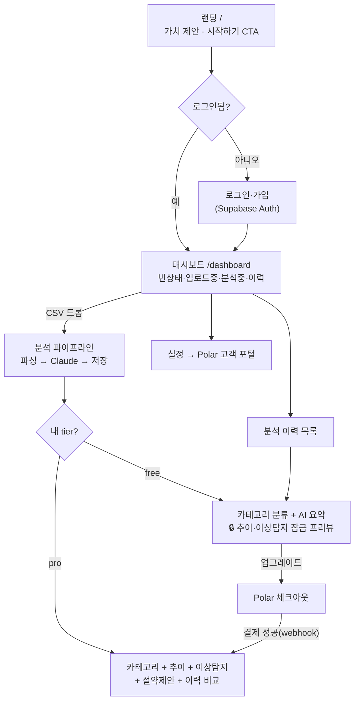
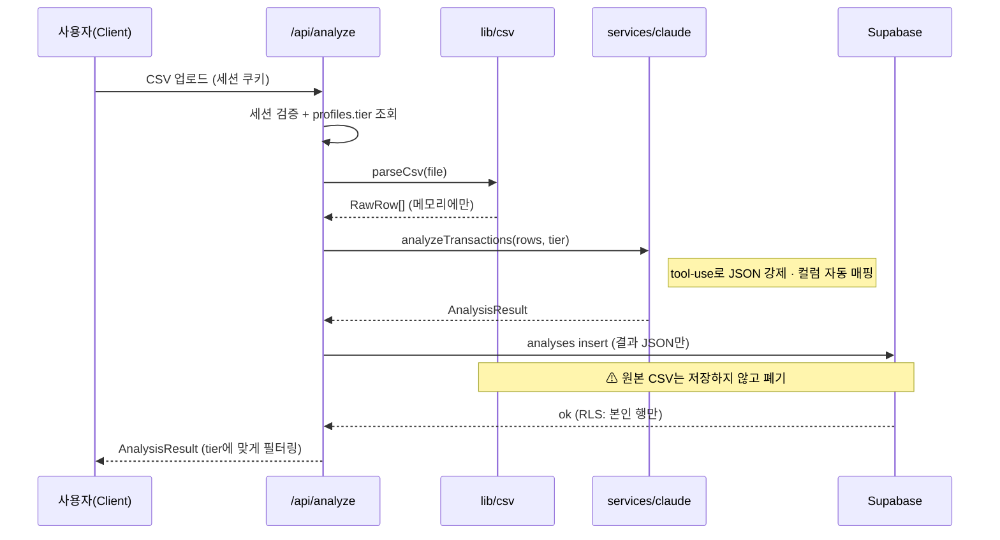
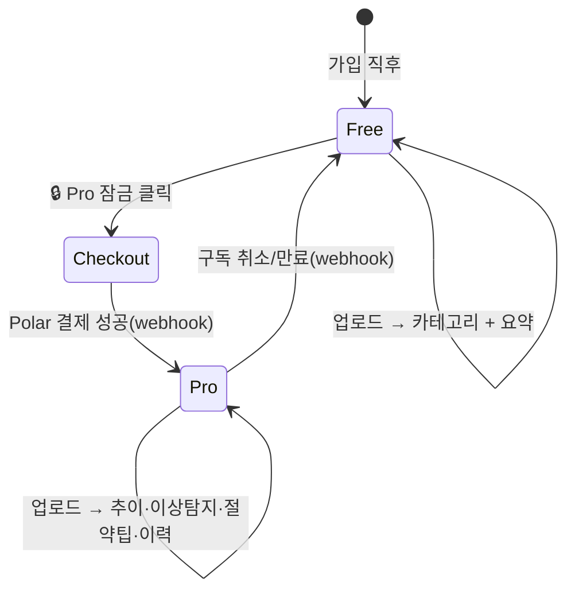

# 사용자 흐름 (User Flow)

이 문서는 FinSight의 화면 전환·데이터 흐름·요금제 분기를 정의한다.
UI/대시보드/랜딩/결제 구현(step3·6·7·8·9)은 이 흐름을 그대로 따른다.

## 페르소나 & Use Case

| # | 페르소나 | 하고 싶은 것 | 진입점 | 성공 |
|---|----------|--------------|--------|------|
| UC1 | 첫 방문자 | 이 앱이 뭘 해주는지 이해 | 랜딩 `/` | 가입 클릭 |
| UC2 | 신규 가입자 (Activation) | 첫 명세서 업로드 → 즉시 인사이트 | `/dashboard` 빈 상태 | 카테고리+요약 확인 |
| UC3 | Free 사용자 (Conversion) | 추이·이상탐지를 보고 싶음 | 🔒 Pro 잠금 카드 | 업그레이드 결제 |
| UC4 | Pro 사용자 (Retention) | 전월 대비 비교, 절약 포인트 | `/dashboard` + 이력 | 추이·이상·절약팁 |
| UC5 | 재방문자 | 과거 분석 다시 보기 | 이력 목록 | 저장된 분석 열람 |
| UC6 | 구독자 (Billing) | 구독 취소/변경 | 설정 → Polar 포털 | 셀프서비스 |

## 1. 전체 네비게이션 흐름

## 2. 핵심 분석 파이프라인 (업로드 → 인사이트)

## 3. Free / Pro 상태 전이

## 화면별 상태 인벤토리

| 화면 | 상태 | 담당 step |
|------|------|-----------|
| 랜딩 `/` | 로그아웃 / 로그인됨(CTA 변경) | step8 |
| 로그인·가입 | 입력 / 검증중 / 에러 / 성공→리다이렉트 | step3 |
| 대시보드 | 빈상태 / 업로드중 / 분석중 / 결과 / 에러 | step7 |
| 결과(Free) | 카테고리·요약 + 🔒 Pro 프리뷰 | step7 |
| 결과(Pro) | 카테고리·추이·이상탐지·절약팁·이력 | step7 |
| 이력 목록 | 비어있음 / 카드 리스트 → 클릭 시 재표시 | step7 |
| 설정/빌링 | tier 표시 / 업그레이드 / Polar 포털 | step9 |
