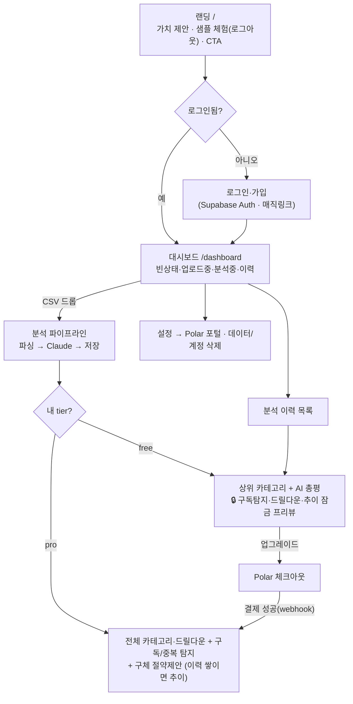
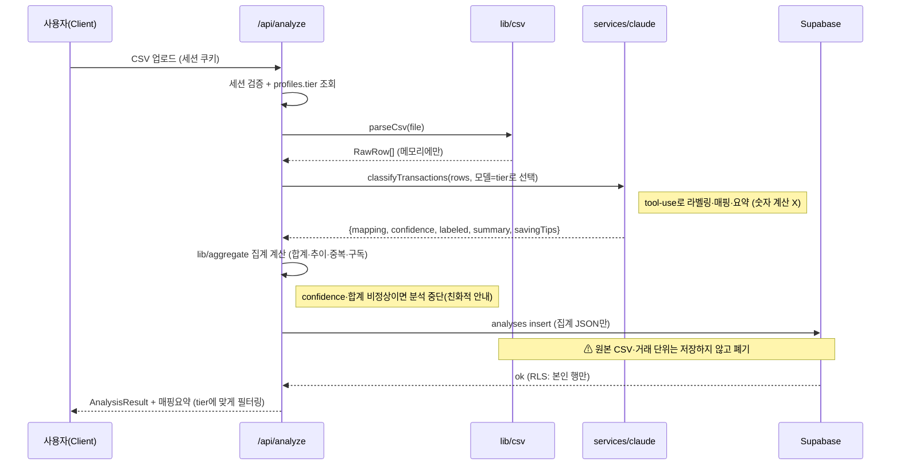
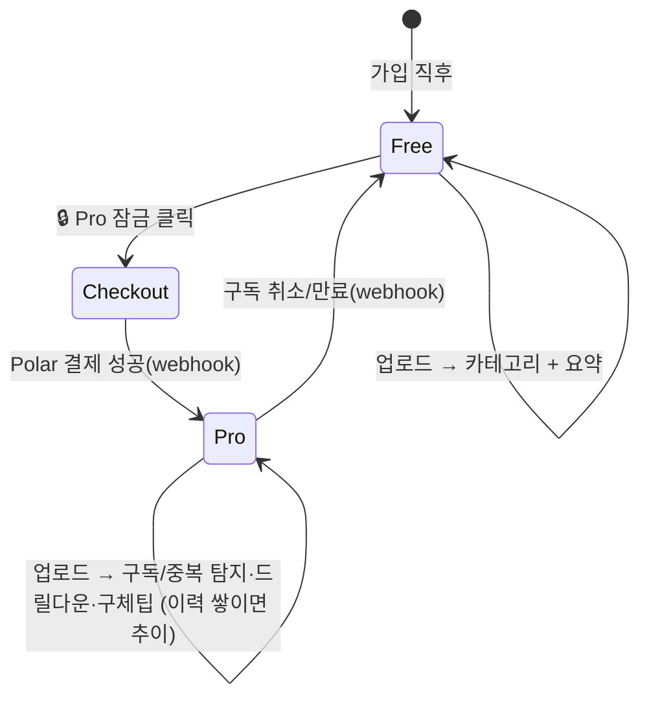

# 사용자 흐름 (User Flow)

이 문서는 FinSight의 화면 전환·데이터 흐름·요금제 분기를 정의한다.
UI/대시보드/랜딩/결제 구현(step3·6·7·8·9)은 이 흐름을 그대로 따른다.

## 페르소나 & Use Case

| # | 페르소나 | 하고 싶은 것 | 진입점 | 성공 |
|---|----------|--------------|--------|------|
| UC1 | 첫 방문자 | 이 앱이 뭘 해주는지 이해 | 랜딩 `/` (로그아웃 샘플 체험) | 가입 클릭 |
| UC2 | 신규 가입자 (Activation) | 첫 명세서 업로드 → 즉시 인사이트 | `/dashboard` 빈 상태 | 카테고리+요약 확인 |
| UC3 | Free 사용자 (Conversion) | 추이·이상탐지를 보고 싶음 | 🔒 Pro 잠금 카드 | 업그레이드 결제 |
| UC4 | Pro 사용자 (Retention) | 전월 대비 비교, 절약 포인트 | `/dashboard` + 이력 | 추이·이상·절약팁 |
| UC5 | 재방문자 | 과거 분석 다시 보기 | 이력 목록 | 저장된 분석 열람 |
| UC6 | 구독자 (Billing) | 구독 취소/변경 | 설정 → Polar 포털 | 셀프서비스 |

## 1. 전체 네비게이션 흐름

## 2. 핵심 분석 파이프라인 (업로드 → 인사이트)

## 3. Free / Pro 상태 전이

## 화면별 상태 인벤토리

| 화면 | 상태 | 담당 step |
|------|------|-----------|
| 랜딩 `/` | 로그아웃(+샘플 체험) / 로그인됨(CTA 변경) | step8 |
| 로그인·가입 | 매직링크 입력 / 메일 발송됨 / 에러 / 성공→리다이렉트 | step3 |
| 대시보드 | 빈상태 / 업로드중 / 분석중 / 결과 / 에러 / 저신뢰(읽기 실패) | step7 |
| 결과(공통) | 상단 매핑 요약 배너(읽은 컬럼·총건수·합계) | step7 |
| 결과(Free) | 상위 카테고리·총평 + 🔒 Pro 프리뷰 | step7 |
| 결과(Pro) | 전체 카테고리·드릴다운·구독/중복 탐지·구체팁 (이력 쌓이면 추이) | step7 |
| 이력 목록 | 비어있음 / 카드 리스트 → 클릭 시 집계 재현 (드릴다운은 재업로드) | step7 |
| 설정/빌링 | tier 표시 / 업그레이드 / Polar 포털 / 이력·계정 삭제 | step9 |
